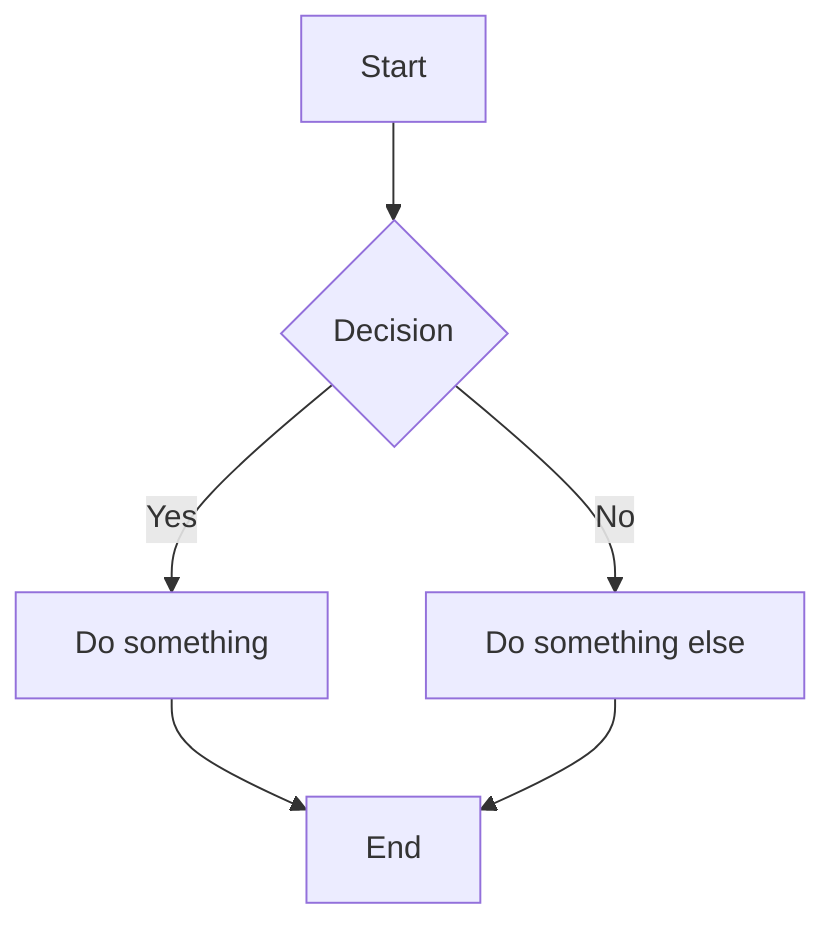

# 📝 Markdown Development Cheatsheet

## 📋 **Quick Reference**

### **🎯 Key Prefix: `<leader>m*`**
All Markdown commands use lowercase `m` for Markdown development.

---

## 👀 **Preview & Rendering**

| Key | Command | Description |
|-----|---------|-------------|
| `<leader>mp` | Markdown preview | Toggle live preview in browser |
| `<leader>mv` | Toggle markview | Toggle in-buffer rendering |

### **🌐 Live Preview Features**
- **Real-time updates**: Changes appear instantly
- **Synchronized scrolling**: Preview follows editor
- **Math support**: KaTeX for mathematical expressions
- **Diagram support**: Mermaid diagrams
- **Dark/Light themes**: Matches your editor theme

---

## 📊 **Table Management**

| Key | Command | Description |
|-----|---------|-------------|
| `<leader>mt` | Toggle table mode | Enable/disable table editing |

### **📋 Table Mode Features**
When table mode is active:
- **Auto-formatting**: Tables align automatically as you type
- **Easy navigation**: Tab between cells
- **Smart borders**: Borders adjust to content
- **Cell operations**: Add/remove rows and columns easily

### **📊 Table Example**
```markdown
| Feature | Status | Priority |
|---------|--------|----------|
| API     | Done   | High     |
| UI      | WIP    | Medium   |
| Tests   | TODO   | High     |
```

---

## 📑 **Table of Contents**

| Key | Command | Description |
|-----|---------|-------------|
| `<leader>mT` | Generate TOC | Auto-generate table of contents |

### **📋 TOC Features**
- **Auto-updating**: Updates on save
- **GitHub compatible**: Uses GFM format
- **Nested headings**: Supports all heading levels
- **Customizable**: Options for format and placement

### **📑 Example TOC**
```markdown
# Table of Contents

- [Introduction](#introduction)
- [Getting Started](#getting-started)
  - [Installation](#installation)
  - [Configuration](#configuration)
- [Advanced Usage](#advanced-usage)
```

---

## 🖼️ **Image Management**

| Key | Command | Description |
|-----|---------|-------------|
| `<leader>mi` | Paste image | Paste image from clipboard |

### **🖼️ Image Features**
- **Clipboard paste**: Direct paste from clipboard
- **Drag & drop**: Drag images into editor
- **Auto-naming**: Smart filename generation
- **Path handling**: Relative paths for portability
- **Format support**: PNG, JPG, GIF, WebP

### **📸 Image Workflow**
1. Copy image to clipboard (screenshot, etc.)
2. `<leader>mi` in Neovim
3. Enter filename when prompted
4. Image saves to local directory
5. Markdown link auto-inserted

---

## ✨ **Enhanced Viewing (Markview)**

### **🎨 In-Buffer Rendering**
- **Live rendering**: See formatted text in editor
- **Syntax highlighting**: Code blocks with colors
- **Math rendering**: LaTeX math expressions
- **List formatting**: Styled bullet points and numbers
- **Emphasis**: Bold, italic, strikethrough styling
- **Links**: Clickable links with icons

### **🔧 Markview Controls**
```
<leader>mv    # Toggle markview on/off
Normal mode   # Rendered view
Insert mode   # Raw markdown for editing
```

---

## 📝 **Markdown Syntax Quick Reference**

### **📑 Headers**
```markdown
# H1 Header
## H2 Header
### H3 Header
#### H4 Header
##### H5 Header
###### H6 Header
```

### **🎨 Text Formatting**
```markdown
**Bold text**
*Italic text*
***Bold and italic***
~~Strikethrough~~
`Inline code`
```

### **📋 Lists**
```markdown
<!-- Unordered lists -->
- Item 1
- Item 2
  - Nested item
  - Another nested item

<!-- Ordered lists -->
1. First item
2. Second item
   1. Nested numbered item
   2. Another nested item

<!-- Task lists -->
- [x] Completed task
- [ ] Incomplete task
```

### **🔗 Links & Images**
```markdown
[Link text](https://example.com)
[Link with title](https://example.com "Title")


<!-- Reference links -->
[Link text][1]
[1]: https://example.com
```

### **💻 Code Blocks**
````markdown
```python
def hello_world():
    print("Hello, World!")
```

```bash
echo "Hello from bash"
```
````

### **📊 Tables**
```markdown
| Column 1 | Column 2 | Column 3 |
|----------|----------|----------|
| Cell 1   | Cell 2   | Cell 3   |
| Cell 4   | Cell 5   | Cell 6   |

<!-- Alignment -->
| Left | Center | Right |
|:-----|:------:|------:|
| L1   |   C1   |    R1 |
| L2   |   C2   |    R2 |
```

### **📝 Quotes & Breaks**
```markdown
> This is a blockquote
> It can span multiple lines
>
> > Nested quotes are possible

---
Horizontal rule above
```

---

## 🧮 **Math & Diagrams**

### **🔢 Math Support (KaTeX)**
```markdown
Inline math: $E = mc^2$

Block math:
$$
\int_{-\infty}^{\infty} e^{-x^2} dx = \sqrt{\pi}
$$
```

### **📊 Mermaid Diagrams**
````markdown

````

---

## 📐 **LSP Features**

| Key | Command | Description |
|-----|---------|-------------|
| `gd` | Go to link | Follow link under cursor |
| `K` | Hover info | Show link destination |
| `<leader>ca` | Code actions | Available actions |

### **🔍 Markdown LSP Features**
- **Link validation**: Checks for broken links
- **Reference completion**: Auto-complete references
- **Header navigation**: Jump between headers
- **Spell checking**: Built-in spell check
- **Link following**: Click to open links

---

## 🎯 **Common Workflows**

### **📝 Blog Post Workflow**
1. Create new `.md` file
2. `<leader>mT` - Generate TOC placeholder
3. Write content with headers
4. `<leader>mT` - Update TOC
5. `<leader>mp` - Preview in browser
6. Publish when ready

### **📖 Documentation Workflow**
1. Structure with headers
2. `<leader>mt` - Enable table mode for data
3. Add code examples
4. `<leader>mi` - Add screenshots
5. `<leader>mv` - Toggle rendering for review
6. `<leader>mp` - Final preview

### **📋 README Workflow**
1. Start with project overview
2. `<leader>mT` - Add TOC
3. Include installation instructions
4. Add code examples
5. `<leader>mi` - Add project screenshots
6. `<leader>mp` - Preview final result

### **📚 Note-Taking Workflow**
1. Use headers for organization
2. `<leader>mv` - Enable live rendering
3. Mix text, code, and math
4. Use task lists for TODOs
5. Link between related notes

---

## 🎨 **Pro Tips**

💡 **Live preview**: Always use `<leader>mp` for final review
💡 **Table mode**: Makes complex tables much easier
💡 **Markview**: Great for reading, toggle off for editing
💡 **Image paste**: Fastest way to add screenshots
💡 **TOC generation**: Auto-updates keep docs organized
💡 **Task lists**: Perfect for project tracking
💡 **Math support**: Great for technical documentation

### **🔥 Efficiency Tips**
- Use `<leader>mv` to quickly switch between edit/view modes
- Enable table mode only when working with tables
- Use reference links for cleaner markdown
- Combine markview with zen mode for distraction-free writing
- Use task lists with `- [ ]` for interactive TODOs
- Preview frequently with `<leader>mp` to catch formatting issues

### **📝 Writing Tips**
- **Headers**: Use consistent hierarchy (don't skip levels)
- **Links**: Use descriptive text, not "click here"
- **Images**: Always include alt text for accessibility
- **Tables**: Keep simple, use for data only
- **Code**: Include language for syntax highlighting
- **Lists**: Be consistent with formatting style

Your Markdown editing experience is now professional-grade! 📝✨
